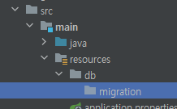
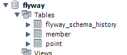
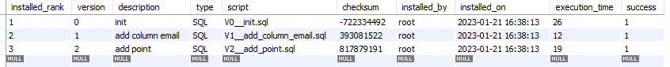
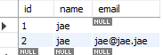
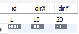

# Flyway 적용해보기
> Flyway는 오픈소스 마이그레이션 툴로 소스코드를 형상관리하는 Git과 같이 버전 관리 목적인 SCHEMA_VERSION 테이블을 통해 SQL 스크립트의 변화를 추적하면서 자동적으로 DB를 관리한다.

```java
//build.gradle
dependencies {
    implementation 'org.springframework.boot:spring-boot-starter-data-jpa'
    
    implementation 'org.flywaydb:flyway-core'
    implementation 'org.flywaydb:flyway-mysql'

    runtimeOnly 'com.mysql:mysql-connector-j'
    ...
}
```

---

### 1. classpath:db/migration


### 2. `applicatio.properties` 설정 추가
```
# flyway
spring.flyway.baseline-on-migrate=true
spring.flyway.baseline-version=0
spring.flyway.useMysqlMetadata=true
```

- spring.flyway.baseline-on-migrate<br/>
기본값 : false<br/>
false로 하려면 flyway_schema_history 테이블이 생성되어 있어야 함<br/>
true로 하면 flyway_schema_history 테이블이 없는 경우 생성함<br/>


- spring.flyway.baseline-version
기본값 : 1<br/>
보통 버전파일이 V1__의 형태로 버전 1부터 시작하기 때문에 0으로 하는 것을 추천<br/>

### 3. 파일 네이밍
- resources/db/migration/ 위치에 sql 파일을 생성

> **# 파일 네이밍 규칙 #**<br/>
> 왼쪽부터 prefix, version, description, suffix 순<br/>
> prefix : default로 V는 버전 마이그레이션, R은 반복 마이그레이션 용 접두사 (반드시 V 혹은 R로 시작)<br/>
> version : version은 버전 마이그레이션에서만 사용되며 숫자나 언더바 조합으로 사용<br/>
> version과 description 사이의 __ (언더바 2개)는 반드시 있어야 함 (1개면 에러 발생)<br/>
> description : schema_version 테이블에 저장시 설명으로 사용<br/>
> suffix : 확장자, 기본은 .sql

<br/>

### [실행결과]



<br/>

`select * from flyway_schema_history;`



`select * from member;`



`select * from point;`



---

[참고]<br/>
https://github.com/woowacourse-teams/2021-zzimkkong/wiki/%5BBE%5D-DB-flyway <br/>
https://backtony.github.io/spring/2021-10-22-spring-db-1/ <br/>
https://jessyt.tistory.com/37
